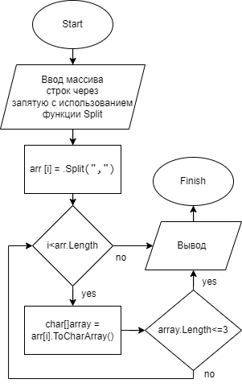

# Решение задачи для итоговой проверочной работы

## Split

Для того, чтобы пользователь самостоятельно вводил элементы массива сначала я создал переменную **arrayStr** в которую были записаны все введенные символы с клавиатуры пользователя.

Далее была создана переменная **array** содержащая в себе массив строк в которую мы передали переменную **arrayStr**, при этом применили функцию **Split(",")** благодаря которой все строки массива были разделены через запятую _","_.

## PrintArray

Далее я использовал метод в котором происходит проверка длины отдельно взятой строки массива и вывода самого массива 

**void PrintArray(string[] arr)**

Для того, чтобы посчитать количество символов в каждой строке нашего массива была создана переменную _char[] array_
в которую мы клали поочередно каждую строку нашего массива. 

**char[] array = arr[i].ToCharArray();**

Далее я использовал счетчик *count*, который считал количество итераций, тем самым считая количество символов в строке нашего массива.

Затем используя условие отбираем нужные нам для вывода строки массива **if (count <= 3)**

И далее выводим поочередно каждую строку нашего массива, которая соответствует нашим требованиям.

## Блок схема моего решения

<!--  -->
